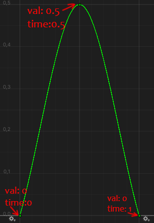

# Ballistic System

## Изменяет Transform имулируя полёт гранаты, с помощью AnimationCurve


### Пример:

```csharp
using Ballistic;
using UnityEngine;

public class BallisticExample : MonoBehaviour
{
    [SerializeField] private BallisticData ballistic;
    [SerializeField] private Transform transform;

    private void FixedUpdate()
    {
        Vector3 pos = transform.localPosition;
        Vector3 scale = transform.localScale;
        
        BallisticData.UpdateLocalPosition(ballistic, Time.fixedDeltaTime, ref pos, ref scale);
        
        transform.localPosition = pos;
        transform.localScale = scale;
    }
}
```
